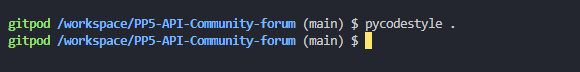

# Project Name

### Table of Contents

- [Project goals](#project-goals)
- [Planning](#planning)
- [Data models](#data-models)
- [Flow Charts](#flow-charts)
- [API endpoints](#api-endpoints)
- [Frameworks, libraries and dependencies](#frameworks-libraries-and-dependencies)
- [Testing](#testing)
  - [Manual testing](#manual-testing)
  - [Automated tests](#automated-tests)
  - [Python validation](#python-validation)
  - [Resolved bugs](#resolved-bugs)
  - [Bugs found while testing the API in isolation](#bugs-found-while-testing-the-api-in-isolation)
  - [Bugs found while testing the frontend](#bugs-found-while-testing-the-frontend)
  - [Unresolved bugs](#unresolved-bugs)
- [Deployment](#deployment)
- [Credits](#credits)

### Project goals

This project provided a Django Rest API for the Threadly react web app, a community forum inspired by Reddit.

Threadly is designed to allow users to post, comment, follow, vote & like content across various channels specific to niche audiences.

## Planning

### Data models

| Entity              | Attributes                                                                                                                                     | Relationships                                                                                                                                                      |
| ------------------- | ---------------------------------------------------------------------------------------------------------------------------------------------- | ------------------------------------------------------------------------------------------------------------------------------------------------------------------ |
| **User**            | id (PK), username, password, email, first_name, last_name, etc.                                                                                | - has one-to-one relationship with Profile, has many-to-one relationship with Channel (owner)                                                                      |
| **Profile**         | id (PK), owner (FK to User), created_at, updated_at, name, content, image                                                                      | - one-to-one relationship with User                                                                                                                                |
| **Channel**         | id (PK), title, description, created_at, updated_at, owner (FK to User), image                                                                 | - has many-to-one relationship with User (owner), has many relationship with ChannelFollower                                                                       |
| **ChannelFollower** | id (PK), owner (FK to User), channel (FK to Channel), created_at                                                                               | - many-to-one relationship with User (owner), many-to-one relationship with Channel                                                                                |
| **Post**            | id (PK), owner (FK to User), created_at, updated_at, title, content, image, channel (FK to Channel), image_filter, followers_count, vote_count | - many-to-one relationship with User (owner), many-to-one relationship with Channel (channel), has many relationship with Comment, has many relationship with Vote |
| **Comment**         | id (PK), owner (FK to User), post (FK to Post), created_at, updated_at, content                                                                | - many-to-one relationship with User (owner), many-to-one relationship with Post                                                                                   |
| **Follower**        | id (PK), owner (FK to User), followed (FK to User), created_at                                                                                 | - many-to-one relationship with User (owner), many-to-one relationship with User (followed)                                                                        |
| **Like**            | id (PK), owner (FK to User), post (FK to Post), created_at                                                                                     | - many-to-one relationship with User (owner), many-to-one relationship with Post                                                                                   |
| **Vote**            | id (PK), user (FK to User), post (FK to Post), vote_type, created_at                                                                           | - many-to-one relationship with User (user), many-to-one relationship with Post                                                                                    |

### API endpoints

| Method | Endpoint                    | Description                                     |
| ------ | --------------------------- | ----------------------------------------------- |
| GET    | /                           | Fetch all posts (homepage)                      |
| GET    | /feed                       | Fetch posts from followed users                 |
| GET    | /liked                      | Fetch liked posts                               |
| GET    | /channels/followed          | Fetch followed channels                         |
| GET    | /signin                     | Sign in form                                    |
| GET    | /signup                     | Sign up form                                    |
| GET    | /posts/:id                  | Fetch a specific post by ID                     |
| GET    | /profiles/:id               | Fetch a specific profile by ID                  |
| GET    | /channels/:title            | Fetch a specific channel by title               |
| GET    | /\*                         | Catch-all for undefined routes (Page not found) |
| POST   | /posts/create               | Create a new post                               |
| POST   | /channel/create             | Create a new channel                            |
| PUT    | /posts/:id/edit             | Edit a specific post by ID                      |
| PUT    | /profiles/:id/edit/username | Edit username of a specific profile by ID       |
| PUT    | /profiles/:id/edit/password | Edit password of a specific profile by ID       |
| PUT    | /profiles/:id/edit          | Edit a specific profile by ID                   |
| PUT    | /channels/:title/edit       | Edit a specific channel by title                |

### Frameworks, libraries and dependencies

- **[asgiref](https://pypi.org/project/asgiref/)**: 3.8.1

  - ASGI utilities and reference implementation.

- **[cloudinary](https://pypi.org/project/cloudinary/)**: 1.40.0

  - Cloudinary API client library for Python.

- **[dj-database-url](https://pypi.org/project/dj-database-url/)**: 0.5.0

  - Utility to utilize the `DATABASE_URL` environment variable to configure Django's database.

- **[dj-rest-auth](https://pypi.org/project/dj-rest-auth/)**: 2.1.9

  - API endpoints for handling authentication in Django Rest Framework.

- **[Django](https://pypi.org/project/Django/)**: 3.2

  - A high-level Python Web framework that encourages rapid development and clean, pragmatic design.

- **[django-allauth](https://pypi.org/project/django-allauth/)**: 0.44.0

  - Integrated set of Django applications addressing authentication, registration, account management.

- **[django-cloudinary-storage](https://pypi.org/project/django-cloudinary-storage/)**: 0.3.0

  - Django package that provides Cloudinary storages for both media and static files as well as management commands for removing unnecessary files.

- **[django-cors-headers](https://pypi.org/project/django-cors-headers/)**: 3.11.0

  - Django app for handling the server headers required for Cross-Origin Resource Sharing (CORS).

- **[django-filter](https://pypi.org/project/django-filter/)**: 2.4.0

  - A reusable Django application for allowing users to filter querysets dynamically.

- **[django-restframework](https://pypi.org/project/django-restframework/)**: 0.0.1

  - A toolkit for building Web APIs in Django.

- **[djangorestframework](https://pypi.org/project/djangorestframework/)**: 3.13.1

  - A powerful and flexible toolkit for building Web APIs in Django.

- **[djangorestframework-simplejwt](https://pypi.org/project/djangorestframework-simplejwt/)**: 4.7.2

  - A JSON Web Token authentication plugin for the Django REST Framework.

- **[gunicorn](https://pypi.org/project/gunicorn/)**: 22.0.0

  - A Python WSGI HTTP Server for UNIX.

- **[oauthlib](https://pypi.org/project/oauthlib/)**: 3.2.2

  - A generic, spec-compliant, thorough implementation of the OAuth request-signing logic.

- **[pillow](https://pypi.org/project/pillow/)**: 10.3.0

  - A Python Imaging Library (PIL) fork that adds image processing capabilities.

- **[psycopg2](https://pypi.org/project/psycopg2/)**: 2.9.9

  - PostgreSQL database adapter for Python.

- **[PyJWT](https://pypi.org/project/PyJWT/)**: 2.8.0

  - JSON Web Token implementation in Python.

- **[python3-openid](https://pypi.org/project/python3-openid/)**: 3.2.0

  - Python library for OpenID authentication.

- **[pytz](https://pypi.org/project/pytz/)**: 2024.1

  - World Timezone Definitions for Python.

- **[requests-oauthlib](https://pypi.org/project/requests-oauthlib/)**: 2.0.0

  - OAuthlib integration with `requests`.

- **[sqlparse](https://pypi.org/project/sqlparse/)**: 0.5.0
  - A non-validating SQL parser for Python.

## Testing

#### Manual testing

A series of manual tests were carried out for each end point using the Django Rest Framework HTML interface running on the local server and using the deployed database. Please see the separate [testing.md](testing.md) document for details.

All the features of the deployed API were tested as part of testing/acceptance criteria for each of the React frontend user stories. These tests are documented in the read-me for that project.

#### Python validation

All python was validated with the CI Python Linter & the pycodestyle tool to ensure pep8 validation.

### Deployment

The Threadly API is deployed to Heroku, using an ElephantSQL Postgres database. To duplicate deployment to Heroku, follow these steps:

1. **Fork or clone this repository in GitHub.**

2. **Cloudinary Setup:**

   - You will need a Cloudinary account to host user profile images.
   - Login to Cloudinary.
   - Select the 'dashboard' option.
   - Copy the value of the 'API Environment variable' from the part starting `cloudinary://` to the end. You may need to select the eye icon to view the full environment variable. Paste this value somewhere for safe keeping as you will need it shortly (but destroy after deployment).

3. **Heroku Setup:**

   - Log in to Heroku.
   - Select 'Create new app' from the 'New' menu at the top right.
   - Enter a name for the app (e.g., `threadly`) and select the appropriate region.
   - Select 'Create app'.
   - Select 'Settings' from the menu at the top.

4. **ElephantSQL Setup:**

   - Login to ElephantSQL.
   - Click 'Create new instance' on the dashboard.
   - Name the 'plan' and select the 'Tiny Turtle (free)' plan.
   - Select 'select region'.
   - Choose the nearest data centre to your location.
   - Click 'Review'.
   - Go to the ElephantSQL dashboard and click on the 'database instance name' for this project.
   - Copy the ElephantSQL database URL to your clipboard (this starts with `postgres://`).

5. **Heroku Configuration:**

   - Return to the Heroku dashboard.
   - Select the 'Settings' tab.
   - Locate the 'reveal config vars' link and select it.
   - Enter the following config var names and values:
     - `CLOUDINARY_URL`: your Cloudinary URL as obtained above
     - `DATABASE_URL`: your ElephantSQL Postgres database URL as obtained above
     - `SECRET_KEY`: your secret key
     - `ALLOWED_HOST`: the URL of your Heroku app (but without the `https://` prefix)

6. **Deploying to Heroku:**
   - Select the 'Deploy' tab at the top.
   - Select 'GitHub' from the deployment options and confirm you wish to deploy using GitHub. You may be asked to enter your GitHub password.
   - Find the 'Connect to GitHub' section and use the search box to locate your repo.
   - Select 'Connect' when found.
   - Optionally choose the main branch under 'Automatic Deploys' and select 'Enable Automatic Deploys' if you wish your deployed API to be automatically redeployed every time you push changes to GitHub.
   - Find the 'Manual Deploy' section, choose 'main' as the branch to deploy and select 'Deploy Branch'.
   - Your API will shortly be deployed and you will be given a link to the deployed site when the process is complete.

### Credits

The Code Institute Moments DRF API was used as a base for the project.
